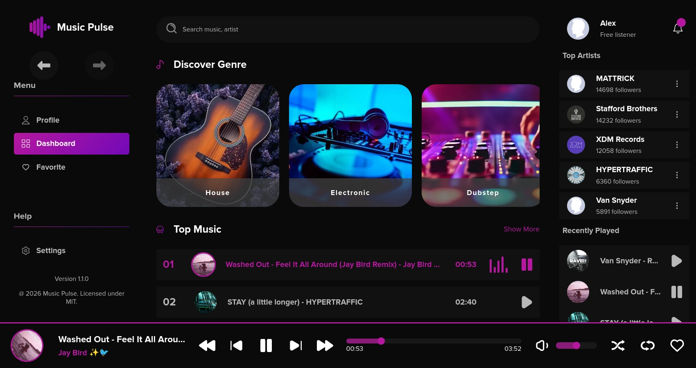
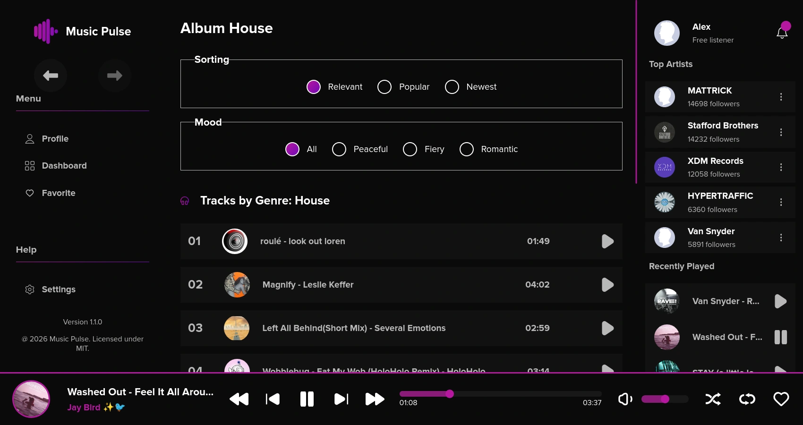
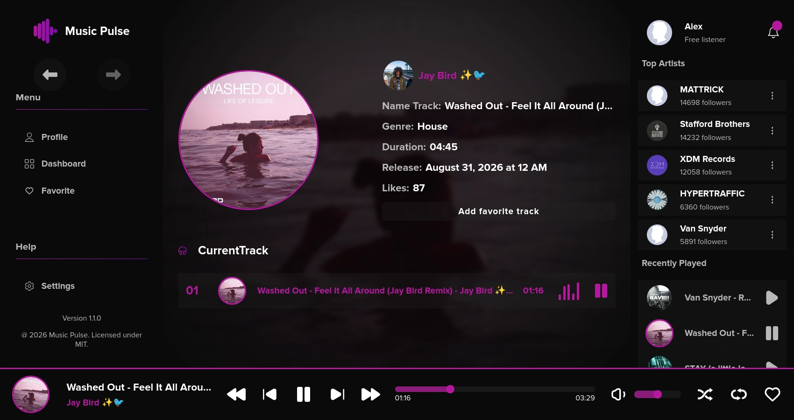
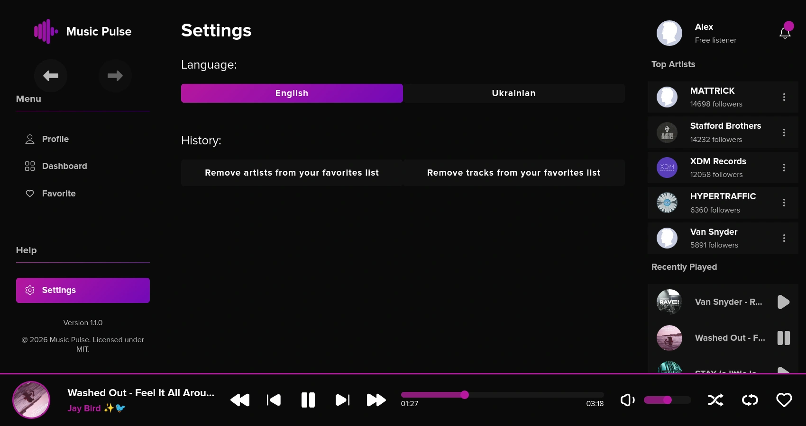

<h1 align="center">
    
    <br>
    <p> Music Pulse - Player</p>
</h1>

---

Music Pulse is a cutting-edge, high-performance music streaming web application built using the latest stable React ecosystem. Featuring a premium dark mode design with neon violet highlights, it offers full-scale audio playback management, dynamic data fetching, precise type safety, and responsive layouts tailored for modern web browsers.

The project strictly adheres to **Feature-Sliced Design (FSD)** architecture principles and includes advanced performance tweaks like automatic image asset optimization pipelines.

**Project was initially developed locally without version control and later imported into GitHub.**

---

## Live Demo

- **Deployed App:** [Link to Vercel](https://music-pulse-player.vercel.app/)
- **Design Core:** UI/UX concept inspired by [Figma Community](https://www.figma.com/community/file/1255801381916515982/music-1-music-dashboard)
- **Data Source:** Powered by [Audius API](https://docs.audius.co/api/)

---

## Screenshots

<p align="center">
    
</p>

<p align="center">
    
</p>

<p align="center">
    
</p>

<p align="center">
    
</p>

---

## Key Features & Architectural Highlights

### Complete Application Views

- **Dashboard & Swipers (`dashboard-page`):** Fluid, high-performance genre/playlist sliders powered by `embla-carousel-react` with native scroll fallbacks.
- **Artist Dynamic Profiles (`artist-page`):** Displays comprehensive metadata (Location, Subscribes, Album counts, Bio) alongside a reactive tracking table containing full discography controls.
- **Detailed Track Insights (`track-page`):** Dedicated playback views featuring blurred background ambient covers, track length metrics, release timelines, and favorite counters.
- **Interactive Control Center (`settings-page`):** Allows users to dynamically toggle internationalization contexts (English / Ukrainian) and wipe targeted metadata clusters like local history or favorite tracks.

### Performance & Polish

- **Asset Optimization Pipeline:** Built-in automatic image compressions via `vite-plugin-image-optimizer` relying on `sharp` and `svgo` node runtimes to ensure minimal bundle footprints and fast image loading times.
- **Skeleton States:** Zero layout shifts (CLS) achieved through custom layout placeholders utilizing `react-loading-skeleton`.
- **Reactive Notification System:** Clean, non-blocking asynchronous toast layers reflecting immediate client updates such as language modifications or system state changes.

---

## Tech Stack & Dependencies

The codebase relies strictly on a production-ready, ultra-modern tech stack:

- **Core Runtime:** React 19 (Strict Mode active), TypeScript ~5.9, Vite 8+ (Native ESM Modules setup).
- **Backend & Database Service:** Supabase Client `@supabase/supabase-js` 2.116 (Handles user authentication, session registration, and relational data management for user profiles, favorite artists, and tracks).
- **State Architecture:** Redux Toolkit 2.11 (Slices, Selectors, Custom Action Listeners) paired with React Redux 9.2.
- **Data Hydration:** RTK Query (Robust REST API async handling, automatic polling, and caching).
- **Client Routing:** React Router DOM 7.13 (Protected routes, dynamic parameters, nested outlet layouts).
- **Runtime Data Validation:** Zod 4.4.3 (Type-safe schema validation, API response parsing, runtime data contracts, and automatic TypeScript type inference).
- **Forms & Inputs:** React Hook Form 7.72.
- **Styling Architecture:** Sass 1.98 (SCSS Modules), BEM Methodology, `clsx` utility modifiers, and dynamic CSS Custom Properties.
- **UI Components & Motion:** `embla-carousel-react` 8.6 (for fluid genre sliders) and `react-loading-skeleton` 3.5.
- **Build & Optimization Plugins:** `vite-plugin-image-optimizer` (powered by `sharp` and `svgo`), `vite-plugin-svgr` 4.5 (for transforming SVGs into reactive components), and `@vitejs/plugin-react` 6.0.

---

## Feature-Sliced Design (FSD) Layout

The directory hierarchy follows exact FSD slice abstractions ensuring bulletproof maintainability:

- `1_app/` — Root configurations, application styles setup, core React Router bindings, and Redux global state stores.
- `2_pages/` — Composite view components generating application routes (`dashboard-page`, `artist-page`, `track-page`, `settings-page`).
- `3_widgets/` — Complex structural layout aggregates combining isolated slices (`player-bar-widget`, `aside-widget`, `filtered-tracks-widget`).
- `4_features/` — Encapsulated user-interactive action components (`player-controls`, `toggle-lang`, `clear-history`, `duration-change`).
- `5_entities/` — Business domains, specific UI model cards, and targeted state logic slices (`track`, `artist`, `album`, `player`, `user`).
- `6_shared/` — Abstract reusable layers containing core HTTP API configuration clients, global design system styles, utility hooks (`lib`), and structural UI elements (`ui`).

---

## Getting Started Locally

1. Clone the project locally:

```bash
git clone https://github.com/tin0x/music-pulse-player.git
```

2. Boot into the source directory and pull production dependencies:

```bash
cd music-pulse-player
pnpm install
```

3. Set up your environment variables (.env.local) with your Supabase:

```
VITE_SUPABASE_URL=https://your-project.supabase.co
VITE_SUPABASE_PUBLIC_KEY=your-publishable-key
VITE_MUSIC_API_BASE_URL=https://your-project.audiusApi.co
```

4. Fire up Vite local dev environment:

```bash
pnpm run dev
```

5. Run strict static type checks and compile production-ready assets:

```bash
pnpm run build
```

6. Run ESLint validation checks to ensure strict architectural formatting guidelines:

```bash
pnpm run lint
```
